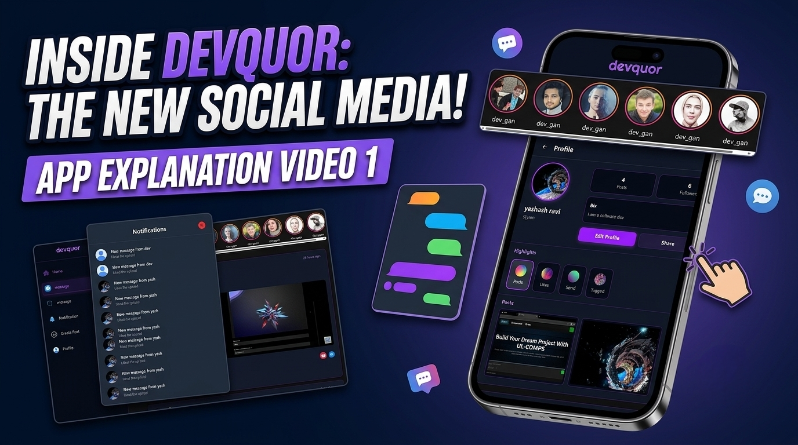

# Devgram / Devquor Public Overview

This document is intended for public reference and showcases selected code samples. The original source files and full implementations remain the intellectual property of the author. For access to complete information or collaboration inquiries, please contact Ultriti via the same email address associated with the author’s GitHub profile. All sensitive data is securely maintained in private repositories to ensure confidentiality and integrity

visit the app on this link [https://devquor.ultriti.com/](https://devquor.ultriti.com/ "Visit Devquor")

## Devgram at a Glance

Devgram is a modern social experience designed specifically for developers and technical communities. It blends fast content sharing, meaningful conversations, and focused community spaces into one intuitive platform.

> A place where developers can publish ideas, join topic-based groups, and stay connected through real-time collaboration.

---

## Why Devgram Matters

Devgram is built for people who want more than a generic social network.

- **Developer-first design**: Built around code thinking, idea sharing, and technical conversation.
- **Focused social interaction**: Encourages useful discussion, not noise.
- **Group collaboration**: Supports private and public communities for teams, study groups, and interest-based clusters.
- **Real-time connection**: Chat and notifications help users stay responsive and engaged.

---

## Core Strengths

### 1. Engaging developer feed
- Post thoughts, ideas, and media
- Like and bookmark posts
- Read and reply to comments
- View rich author details and activity

### 2. Deep conversation threads
- Comment on posts
- Add threaded replies
- React to specific replies
- Follow the discussion easily

### 3. Community spaces
- Create group clusters for team topics
- Join existing groups to collaborate
- Manage community details and content
- Keep conversations organized

### 4. Private messaging
- Send direct messages to other members
- Keep conversations personal and secure
- Easily continue collaboration outside public groups

### 5. Notifications & real-time updates
- Stay informed when other users interact
- Save and use notification tokens
- Keep activity top-of-mind for engagement

---

## Who Should Use Devgram?

### Ideal for:
- Developers sharing ideas, code concepts, and technical stories
- Teams working on projects and seeking feedback
- Learning communities and study groups
- Tech meetups, hackathons, and developer circles

### Benefits for users:
- Share progress quickly
- Discover relevant developer content
- Build stronger community connections
- Save important conversations and posts

---

## Product Highlights

### For Individual Contributors
- Personal profile with editable bio
- Post updates and media
- React to other member posts
- Build a network of peers

### For Community Builders
- Create and manage clusters
- Invite members to join
- Host focused technical conversations
- Keep teams aligned with cluster updates

### For Active Participators
- Join conversations across posts and groups
- Comment and reply in nested threads
- Follow trending discussions
- Use direct messaging for follow-up chats

---

## Visual and UX Considerations

To enhance the presentation, include:
- A screenshot of the main feed or dashboard
- Profile page preview
- Post or upload detail view
- Group cluster page design
- Chat / direct message screen
- Notification list preview

These visuals help viewers understand the product instantly.

---

## Public-Facing Story

Devgram is not just another social app. It is a community platform tailored for people who think like developers:
- clear communication
- organized discussion
- meaningful interaction
- purpose-driven conversations

It helps users connect, collaborate, and grow together in an environment built for technical discussion.

---

## Technical Summary (High Level)

Devgram is powered by modern web technologies:
- Fast frontend experience with a component-based UI
- Smooth backend service to handle users, posts, and groups
- Real-time support for chat and notifications
- Media-ready architecture for uploads and community content

This makes the platform both polished and practical for a technical audience.

---

## How to Use This Document

This page is ideal for:
- project showcases
- product landing pages
- investor or stakeholder summaries
- public portfolios
- introductory presentations

It explains what Devgram is, who it helps, and why it matters—without exposing implementation details or private data.

---
# Devgram / Devquor Public Overview

## Devgram at a Glance

Devgram is a modern social experience designed specifically for developers and technical communities. It blends fast content sharing, meaningful conversations, and focused community spaces into one intuitive platform.

> A place where developers can publish ideas, join topic-based groups, and stay connected through real-time collaboration.

---

## Why Devgram Matters

Devgram is built for people who want more than a generic social network.

- **Developer-first design**: Built around code thinking, idea sharing, and technical conversation.
- **Focused social interaction**: Encourages useful discussion, not noise.
- **Group collaboration**: Supports private and public communities for teams, study groups, and interest-based clusters.
- **Real-time connection**: Chat and notifications help users stay responsive and engaged.

---

## Core Strengths

### 1. Engaging developer feed
- Post thoughts, ideas, and media
- Like and bookmark posts
- Read and reply to comments
- View rich author details and activity

### 2. Deep conversation threads
- Comment on posts
- Add threaded replies
- React to specific replies
- Follow the discussion easily

### 3. Community spaces
- Create group clusters for team topics
- Join existing groups to collaborate
- Manage community details and content
- Keep conversations organized

### 4. Private messaging
- Send direct messages to other members
- Keep conversations personal and secure
- Easily continue collaboration outside public groups

### 5. Notifications & real-time updates
- Stay informed when other users interact
- Save and use notification tokens
- Keep activity top-of-mind for engagement

---

## Who Should Use Devgram?

### Ideal for:
- Developers sharing ideas, code concepts, and technical stories
- Teams working on projects and seeking feedback
- Learning communities and study groups
- Tech meetups, hackathons, and developer circles

### Benefits for users:
- Share progress quickly
- Discover relevant developer content
- Build stronger community connections
- Save important conversations and posts

---

## Product Highlights

### For Individual Contributors
- Personal profile with editable bio
- Post updates and media
- React to other member posts
- Build a network of peers

### For Community Builders
- Create and manage clusters
- Invite members to join
- Host focused technical conversations
- Keep teams aligned with cluster updates

### For Active Participators
- Join conversations across posts and groups
- Comment and reply in nested threads
- Follow trending discussions
- Use direct messaging for follow-up chats

---

## Visual and UX Considerations

To enhance the presentation, include:
- A screenshot of the main feed or dashboard
- Profile page preview
- Post or upload detail view
- Group cluster page design
- Chat / direct message screen
- Notification list preview

These visuals help viewers understand the product instantly.

---

## Public-Facing Story

Devgram is not just another social app. It is a community platform tailored for people who think like developers:
- clear communication
- organized discussion
- meaningful interaction
- purpose-driven conversations

It helps users connect, collaborate, and grow together in an environment built for technical discussion.

---

## Technical Summary (High Level)

Devgram is powered by modern web technologies:
- Fast frontend experience with a component-based UI
- Smooth backend service to handle users, posts, and groups
- Real-time support for chat and notifications
- Media-ready architecture for uploads and community content

This makes the platform both polished and practical for a technical audience.

---
---

# 📚 Complete Project Walkthrough Playlist

Looking for a deeper understanding of **DevQuor**?

The complete walkthrough playlist contains detailed explanations of the project's architecture, implementation, and development process. New videos will be added regularly as the project evolves.

🎥 **Watch the Full Playlist**

## 📖 Playlist Includes

- 🏗️ Project Architecture
- 🎨 Frontend UI Development
- ⚛️ React Component Design
- 🔄 Frontend ↔ Backend Communication
- 🔐 Authentication & Authorization
- 📝 Upload (Post) Management
- ❤️ Like & Unlike Functionality
- 👤 Profile Page & Profile Editing
- 💬 Real-time Communication
- 🗄️ MongoDB Database Design
- 🌐 REST API Development
- 📂 Folder Structure & Code Organization
- 🧠 Code Flow & Logic Explanation
- 🚀 Deployment Process
- ✨ Upcoming Features & Improvements

> **Note:** This playlist is actively maintained and will continue to grow as new features are added to DevQuor. If you're interested in understanding how the project is built from the ground up, consider following the playlist for future updates.