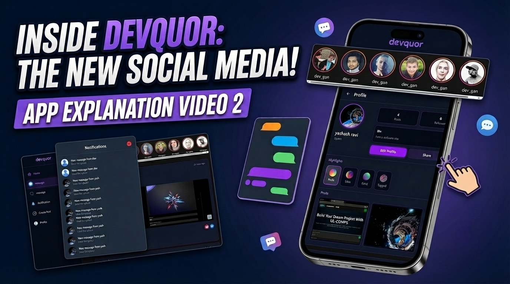

# 🎥 Project Walkthrough – Part 2

This repository includes a video walkthrough series explaining the design, implementation, and workflow of **DevQuor**.

The current video provides an overview of the project's architecture, major features, and the logic behind the implementation. More walkthroughs covering additional modules and advanced concepts will be added over time.

The walkthrough explains the complete messaging workflow, backend architecture, database interactions, and the implementation behind seamless real-time communication.

> 📌 Click the thumbnail below to watch the walkthrough.

## 📖 What's Covered

### 💬 User-to-User Messaging
- One-to-one private conversations
- Creating and managing chat sessions
- Sending and receiving messages
- Message history and synchronization

### 👥 Cluster (Group) System
- Creating new clusters
- Joining existing clusters
- Cluster information and management
- Member management workflow
- Group communication features

### ⚡ Real-Time Communication
- Instant message delivery
- Socket.IO event handling
- Live message synchronization
- Online interaction updates
- Efficient real-time data flow

### 🔔 Notification System
- Real-time message notifications
- Cluster activity notifications
- Live notification updates
- Notification handling workflow

### 🛠 Backend Architecture
- Messaging APIs
- Socket.IO server implementation
- Database schema for chats and clusters
- Real-time event broadcasting
- Backend request lifecycle

### 💻 Code Walkthrough
- Messaging module structure
- Cluster management implementation
- Frontend and backend communication
- Socket.IO integration
- State management for chats
- Real-time UI updates
- Code explanation for messaging and clusters

## 🚀 Upcoming Walkthroughs

Future videos will include detailed explanations of:

- Advanced Notification System
- Search & Discovery Features
- Media Sharing
- File Upload System
- Admin & Moderation Tools
- Performance Optimizations
- Scaling Real-Time Infrastructure
- Security & Access Control
- Additional Features and Enhancements

> **Note:** This is an ongoing walkthrough series. As DevQuor evolves, this section will be updated with new videos covering additional features, architectural improvements, and implementation details.